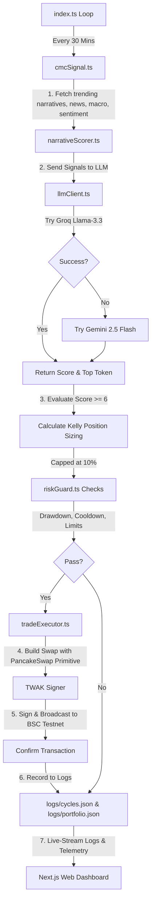

# NarrativeTrader 🤖

NarrativeTrader is an autonomous AI-driven narrative trading agent built for the **BNB Hack: AI Trading Agent Edition** (Track 1 - Autonomous Trading Agents)

The agent detects emerging crypto narratives from CoinMarketCap data via the Model Context Protocol (MCP), scores them qualitatively using a dual-LLM fallback chain (Groq + Gemini), performs quantitative position sizing using the Kelly Criterion with strict risk management, and executes spot buy/sell swaps on PancakeSwap (BSC Testnet) via the BNB Agent SDK and Trust Wallet Agent Kit (TWAK)

---

## DoraHacks Submission Details

- **On-Chain Agent Address (BSC Testnet)**: `0xA273683BE2B645a174164C01c71f2d035c39E7EC`
- **Live Demo Web Terminal**: [https://narrativetrader.onrender.com](https://narrativetrader.onrender.com)
- **Live Terminal Dashboard**: [https://narrativetrader.onrender.com/dashboard](https://narrativetrader.onrender.com/dashboard)
- **Demo Video**: [https://youtu.be/V6IKY1qpPKw](https://youtu.be/V6IKY1qpPKw)
- **Track**: Track 1 — Autonomous Trading Agents

---

## Architecture & Flow



1. **Signal Layer (`src/signal/cmcSignal.ts`)**: Connects to the CoinMarketCap Model Context Protocol (MCP) server at `https://mcp.coinmarketcap.com/mcp` and calls 6 tools in sequence:
   - `trending_crypto_narratives`
   - `get_crypto_quotes_latest`
   - `get_crypto_news`
   - `get_global_metrics_latest`
   - `get_upcoming_macro_events`
   - `get_market_sentiment`
2. **Decision Layer (`src/decision/narrativeScorer.ts`)**: Sends structured market signals to the LLM client. Scores narratives on Momentum, Catalysts, Market Regime, and Safety. If the top narrative score is $\ge 6$, it executes a swap; otherwise, it holds.
3. **LLM Client (`src/utils/llmClient.ts`)**: Executes calls with a dual-LLM fallback mechanism (Groq llama-3.3-70b-versatile $\rightarrow$ Google AI Studio Gemini 2.5 Flash). Output is enforced in strict JSON format.
4. **Risk Guard (`src/risk/riskGuard.ts`)**: Tracks portfolio cash balances and open positions in a persistent JSON state. Enforces a 15% maximum drawdown cap (halts all trading if breached), 3 maximum open positions limit, 10% maximum allocation per trade, and a 2-hour per-token cooldown.
5. **Execution Layer (`src/execution/tradeExecutor.ts`)**: Uses Trust Wallet Agent Kit (TWAK) wallet configuration and the local `bnbagent-sdk` PancakeSwap primitive to build, sign, and broadcast swap transactions on BSC Testnet.
6. **Web Dashboard (`frontend/`)**: Displays real-time terminal telemetry, cycles, trade logs, active positions, interactive charts, and offers full user wallet connectivity.

---

## 🛠️ Technical Stack

### Agent Core
- **Runtime**: Node.js + TypeScript + `ts-node`
- **Wallet & Signing**: Trust Wallet Agent Kit (TWAK) (autonomous agent wallet mode)
- **Execution & Liquidity**: PancakeSwap V2 Router on BSC Testnet
- **Orchestration**: Custom `@bnb-chain/bnbagent-sdk` TypeScript bridge wrapping `viem`

### Frontend UI
- **Framework**: Next.js 16 (App Router) + TypeScript
- **Styling**: Tailwind CSS v4 (Glassmorphic dark alpha terminal aesthetic)
- **Web3 Wallet Connection**: RainbowKit + Wagmi + TanStack Query (enables judges to connect their trust wallets directly on BSC Testnet)
- **Visualizations**: Interactive portfolio performance and asset allocation pie charts via Recharts

---

## Setup Instructions

### 1. Prerequisites
- Node.js (v18 or higher)
- npm or pnpm

### 2. Installation
Clone this repository and install dependencies in both the root and frontend directories:
```bash
# Install root dependencies (Agent loop, SDK tools)
npm install

# Install frontend dependencies (Next.js, Tailwind v4, RainbowKit)
cd frontend
npm install
cd ..
```

### 3. Environment Configuration
Copy `.env.example` to `.env`:
```bash
cp .env.example .env
```
Fill out the variables inside `.env`:
- **`CMC_API_KEY`**: Your CoinMarketCap Professional API key. Get one from [pro.coinmarketcap.com](https://pro.coinmarketcap.com/).
- **`GROQ_API_KEY`**: Your Groq Console API key. Get one from [console.groq.com](https://console.groq.com/).
- **`GEMINI_API_KEY`**: Your Google AI Studio API key. Get one from [aistudio.google.com](https://aistudio.google.com/).
- **`AGENT_PRIVATE_KEY`**: The private key of your autonomous agent's BSC Testnet wallet.
- **`PORTFOLIO_VALUE_USDC`**: The starting hypothetical cash balance in USDC (default: 50).
- **`BSC_RPC_URL`**: BSC Testnet RPC URL (default: `https://data-seed-prebsc-1-s1.binance.org:8545`).
- **`NETWORK`**: Set to `testnet` for BSC Testnet, or `mainnet` for BSC Mainnet.

---

## Helper Scripts & Utilities

Located in the root and the `scratch/` folder to simplify on-chain onboarding and testing:
1. **`npm run approve` (runs [`approveUSDC.ts`](file:///Users/ritesh/.gemini/antigravity-ide/scratch/narrativetrader/approveUSDC.ts))**: Send a one-time transaction to approve USDC for the PancakeSwap Router on behalf of the agent wallet.
2. **`npx ts-node scratch/checkBalance.ts`**: Verifies current BNB and USDC balances of the agent's derived address on BSC Testnet.
3. **`npx ts-node scratch/mintUSDC.ts`**: Mints mock USDC on BSC Testnet to the agent's derived address.
4. **`npx ts-node scratch/swapBNBToUSDC.ts`**: Automatically swaps testnet BNB to USDC using PancakeSwap to fund the agent wallet with starting USDC capital.
5. **`npx ts-node test_cmc_responses.ts`**: Validates connection and checks raw tool output from the CoinMarketCap MCP server.

---

## Robust Simulation & Testing (Out-of-the-Box)

To allow judges to run and evaluate NarrativeTrader instantly without needing a funded BSC Testnet wallet or paid API keys:
1. If **`AGENT_PRIVATE_KEY`** is a dummy placeholder, TWAK automatically toggles to **Simulation Mode** (signs transactions and outputs simulated transaction hashes).
2. If **`CMC_API_KEY`** is a dummy placeholder, the Signal Layer automatically fetches a **rich, realistic mock SignalBundle** (with AI Agents, Real World Assets, and DePIN trending sectors).
3. If **`GROQ_API_KEY`** is a placeholder, it automatically attempts to use the **`GEMINI_API_KEY`** fallback (or vice versa).

---

## Running the Project

### Run Agent and Frontend Concurrently (Production / Deployment Setup)
Spins up both the recurring agent loops and the Next.js production server simultaneously:
```bash
npm start
```

### Run Frontend Web Terminal (Local Dev Server)
```bash
npm run ui
```

### Run Agent Trading Loop (Local Dev Mode with Watcher)
```bash
npm run dev
```

### Build Next.js Production Build
```bash
npm run build
```

---

## Logs & Persistence

The agent saves its runtime status in two files located under the `logs/` directory:
1. **`logs/portfolio.json`**: Tracks the live portfolio state (current cash, peak value, open positions, average entry prices, and transaction history).
2. **`logs/cycles.json`**: An append-only historical log of every 30-minute agent cycle (signals, scores, reasoning, risk checks, and transaction hashes).
