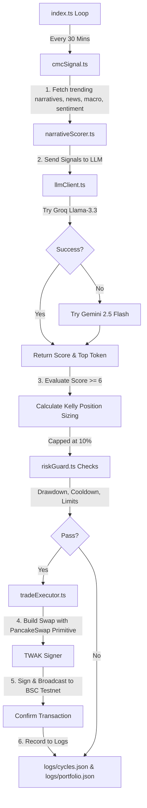

# NarrativeTrader 🤖📊

NarrativeTrader is an autonomous AI-driven crypto trading agent built for the **BNB Hack: AI Trading Agent Edition** (Track 1 — Autonomous Trading Agents). 

The agent detects emerging crypto narratives from CoinMarketCap data, scores them qualitatively using a dual-LLM fallback chain (Groq + Gemini), performs quantitative position sizing using the Kelly Criterion with strict risk management, and executes spot buy/sell orders on PancakeSwap (BSC Testnet) via the BNB Agent SDK and Trust Wallet Agent Kit (TWAK) transaction signing.

---

## 🏗️ Architecture & Flow



1. **Signal Layer (`src/signal/cmcSignal.ts`)**: Connects to the CoinMarketCap Model Context Protocol (MCP) server at `https://mcp.coinmarketcap.com/mcp` and calls 6 tools in sequence:
   - `trending_crypto_narratives`
   - `get_crypto_quotes_latest`
   - `get_crypto_news`
   - `get_global_metrics_latest`
   - `get_upcoming_macro_events`
   - `get_market_sentiment`
2. **Decision Layer (`src/decision/narrativeScorer.ts`)**: Sends structured market signals to the LLM client. Scores narratives on Momentum, Catalysts, Market Regime, and Safety. If the top narrative score is $\ge 6$, it executes a swap; otherwise, it holds.
3. **LLM Client (`src/utils/llmClient.ts`)**: Executes calls with a dual-LLM fallback mechanism (Groq llama-3.3-70b-versatile $\rightarrow$ Google AI Studio Gemini 2.5 Flash). Output is enforced in strict JSON.
4. **Risk Guard (`src/risk/riskGuard.ts`)**: Tracks portfolio cash balances and open positions in a persistent JSON state. Enforces a 15% maximum drawdown cap (halts all trading if breached), 3 maximum open positions limit, 10% maximum allocation per trade, and a 2-hour per-token cooldown.
5. **Execution Layer (`src/execution/tradeExecutor.ts`)**: Uses Trust Wallet Agent Kit (TWAK) wallet configuration and the local `bnbagent-sdk` PancakeSwap primitive to build, sign, and broadcast swap transactions on BSC Testnet.

---

## 🛠️ Technical Stack

- **Runtime**: Node.js + TypeScript + `ts-node`
- **Wallet & Signing**: Trust Wallet Agent Kit (TWAK) (autonomous agent wallet mode)
- **Execution & Liquidity**: PancakeSwap V2 Router on BSC Testnet
- **Orchestration**: Custom `@bnb-chain/bnbagent-sdk` TypeScript bridge wrapping `viem`

---

## ⚙️ Setup Instructions

### 1. Prerequisites
- Node.js (v18 or higher)
- npm or pnpm

### 2. Installation
Clone this repository (or open this folder) and install dependencies:
```bash
npm install
```

### 3. Environment Configuration
Copy `.env.example` to `.env`:
```bash
cp .env.example .env
```
Fill out the variables inside `.env`:
- **`CMC_API_KEY`**: Your CoinMarketCap Professional API key. Get one from [pro.coinmarketcap.com](https://pro.coinmarketcap.com/).
- **`GROQ_API_KEY`**: Your Groq Console API key. Get one from [console.groq.com](https://console.groq.com/).
- **`GEMINI_API_KEY`**: Your Google AI Studio API key. Get one from [aistudio.google.com](https://aistudio.google.com/).
- **`AGENT_PRIVATE_KEY`**: The private key of your autonomous agent's BSC Testnet wallet.
- **`PORTFOLIO_VALUE_USDC`**: The starting hypothetical cash balance in USDC (default: 100).
- **`BSC_RPC_URL`**: BSC Testnet RPC URL (default: `https://data-seed-prebsc-1-s1.binance.org:8545`).
- **`NETWORK`**: Set to `testnet` for BSC Testnet, or `mainnet` for BSC Mainnet.

---

## ⚡ Robust Simulation & Testing (Out-of-the-Box)

To allow judges to run and evaluate NarrativeTrader instantly without needing a funded BSC Testnet wallet or paid API keys:
1. If **`AGENT_PRIVATE_KEY`** is a dummy placeholder, TWAK automatically toggles to **Simulation Mode** (signs transactions and outputs simulated transaction hashes).
2. If **`CMC_API_KEY`** is a dummy placeholder, the Signal Layer automatically fetches a **rich, realistic mock SignalBundle** (with AI Agents, Real World Assets, and DePIN trending sectors).
3. If **`GROQ_API_KEY`** is a placeholder, it automatically attempts to use the **`GEMINI_API_KEY`** fallback (or vice versa).

---

## 🚀 Running the Agent

### Start the recurring loop (runs every 30 minutes):
```bash
npm start
```

### Run in development mode (runs with auto-reload/watcher):
```bash
npm run dev
```

---

## 📂 Logs & Persistence

The agent saves its runtime status in two files located under the `logs/` directory:
1. **`logs/portfolio.json`**: Tracks the live portfolio state (current cash, peak value, open positions, average entry prices, and transaction history).
2. **`logs/cycles.json`**: An append-only historical log of every 30-minute agent cycle (signals, scores, reasoning, risk checks, and transaction hashes).
